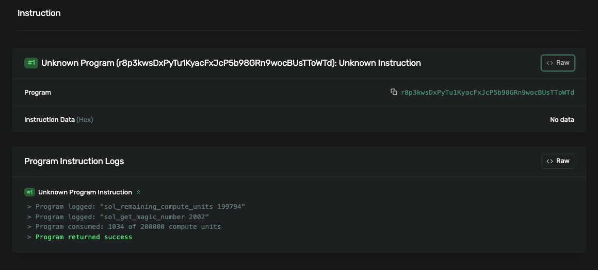

# Custom Syscall in Agave Validator

This is a simple proof of concept for creating a custom syscall in the Agave validator. My goal was to create a simple syscall from a program that returns a string or number.

```rust
msg!("sol_get_magic_number {:?}", sol_get_magic_number()); // returns 2002
```

> My first step when building on complex tech is to achieve simple working code and build complex functionality after it.

## Setup

Clone these Anza repositories:
- [agave](https://github.com/anza-xyz/agave.git)
- [solana-sdk](https://github.com/anza-xyz/solana-sdk)
- [system](https://github.com/solana-program/system)
- [stake](https://github.com/solana-program/stake)

## Research

First, I tried to find the registered syscalls in the `solana-sdk` repo. I searched for a simple one and found `fn sol_remaining_compute_units() -> u64` ([here](https://github.com/4rjunc/solana-sdk/blob/62c9fc28cd556a2d5c4695b5b550c6967e2e6962/define-syscall/src/definitions.rs#L30)). I then searched for the function name `sol_remaining_compute_units()` in both the solana-sdk and agave repos to understand where syscalls need to be defined and registered.

Now I know where a syscall needs to be defined and registered. I began implementing a simple syscall named `sol_get_magic_number()` that returns the number `2002`. There are better ways of doing this - mine is not systematic. I'm sharing how I made changes to the code. I checked out to a new branch named `custom-syscall` in locally cloned agave and solana-sdk repos.

## Implementation Steps

### 1. Define syscall in `solana-sdk/define-syscall`

```rust
// CUSTOM SYSCALL
define_syscall!(fn sol_get_magic_number() -> u64);
// CUSTOM SYSCALL
```
[Link to code](https://github.com/4rjunc/solana-sdk/blob/62c9fc28cd556a2d5c4695b5b550c6967e2e6962/define-syscall/src/definitions.rs#L32C20-L32C40)

### 2. Register syscall in agave repo `agave/programs/bpf_loader`

You can find the `sol_remaining_compute_units` name near my code changes.

Register the syscall:
```rust
// CUSTOM SYSCALL: Accessing the magic number
register_feature_gated_function!(
    result,
    remaining_compute_units_syscall_enabled,
    "sol_get_magic_number",
    SyscallGetMagicNumnberSysvar::vm
)?;
```
[Link to code](https://github.com/4rjunc/agave/blob/526a10c73f1de9ef36bae5e277fc054d3aee85fe/programs/bpf_loader/src/syscalls/mod.rs#L523)

Define the syscall logic:
```rust
// custom sysvar: just returns a number
declare_builtin_function!(
    /// Get a magic-number sysvar
    SyscallGetMagicNumnberSysvar,
    fn rust(
        _invoke_context: &mut InvokeContext,
        _arg1: u64,
        _arg2: u64,
        _arg3: u64,
        _arg4: u64,
        _arg5: u64,
        _memory_mapping: &mut MemoryMapping,
    ) -> Result<u64, Error> {
        Ok(2002)
    }
);
```
[Link to code](https://github.com/4rjunc/agave/blob/526a10c73f1de9ef36bae5e277fc054d3aee85fe/programs/bpf_loader/src/syscalls/mod.rs#L1934C1-L1949C3)

### 3. Make syscall importable in `solana-sdk` repo

Since `sol_remaining_compute_units` can be imported to programs from `use solana_program::compute_units::sol_remaining_compute_units`, I had to find where the code makes it importable. Like before, I searched for the `sol_remaining_compute_units` keyword, which led me to `solana-sdk/program` (the solana_program crate).

Add to `definitions.rs`:
```rust 
pub use solana_define_syscall::definitions::{
    sol_alt_bn128_compression, sol_alt_bn128_group_op, sol_big_mod_exp, sol_blake3,
    sol_curve_group_op, sol_curve_multiscalar_mul, sol_curve_pairing_map, sol_curve_validate_point,
    sol_get_clock_sysvar, sol_get_epoch_rewards_sysvar, sol_get_epoch_schedule_sysvar,
    sol_get_epoch_stake, sol_get_fees_sysvar, sol_get_last_restart_slot, sol_get_magic_number, // <-- HERE!!!
    sol_get_rent_sysvar, sol_get_sysvar, sol_keccak256, sol_remaining_compute_units,
};
```
[Link to code](https://github.com/4rjunc/solana-sdk/blob/62c9fc28cd556a2d5c4695b5b550c6967e2e6962/program/src/syscalls/definitions.rs#L13C74-L13C94)

Create a new file named `magic_number.rs` in `solana-sdk/program/src`:
```rust
/// Return the magic number
#[inline]
pub fn sol_get_magic_number() -> u64 {
    #[cfg(target_os = "solana")]
    unsafe {
        crate::syscalls::sol_get_magic_number()
    }

    #[cfg(not(target_os = "solana"))]
    {
        crate::program_stubs::sol_get_magic_number()
    }
}
``` 
[Link to code](https://github.com/4rjunc/solana-sdk/blob/custom-syscall/program/src/magic_number.rs)

Add to `solana-sdk/program/lib.rs`:
```rust
pub mod magic_number;
```
[Link to code](https://github.com/4rjunc/solana-sdk/blob/62c9fc28cd556a2d5c4695b5b550c6967e2e6962/program/src/lib.rs#L485k)

Add to `solana-sdk/sysvar/program_stubs.rs`:
```rust
fn sol_get_magic_number(&self) -> u64 {
    sol_log("MAGIC NUMBER DEFAULT TO 0");
    0
}
```
[Link to code](https://github.com/4rjunc/solana-sdk/blob/62c9fc28cd556a2d5c4695b5b550c6967e2e6962/sysvar/src/program_stubs.rs#L37)

```rust
pub fn sol_get_magic_number() -> u64 {
    SYSCALL_STUBS.read().unwrap().sol_get_magic_number()
}
```
[Link to code](https://github.com/4rjunc/solana-sdk/blob/62c9fc28cd556a2d5c4695b5b550c6967e2e6962/sysvar/src/program_stubs.rs#L140)

## Sample Program Usage

All code changes are complete. Now I'm adding these dependencies to a sample Solana program. I used a program in the repo to call this syscall. Here you have the `sol_remaining_compute_units` and the custom `sol_get_magic_number`:

```rust
use solana_program::{
    account_info::AccountInfo, compute_units::sol_remaining_compute_units, declare_id, entrypoint,
    entrypoint::ProgramResult, magic_number::sol_get_magic_number, msg,
    program_error::ProgramError, pubkey::Pubkey,
};

#[cfg(test)]
mod tests;

declare_id!("r8p3kwsDxPyTu1KyacFxJcP5b98GRn9wocBUsTToWTd");

entrypoint!(process_instruction);

pub fn process_instruction(
    program_id: &Pubkey,
    _accounts: &[AccountInfo],
    _instruction_data: &[u8],
) -> ProgramResult {
    if program_id.ne(&crate::ID) {
        return Err(ProgramError::IncorrectProgramId);
    }
    msg!(
        "sol_remaining_compute_units {:?}",
        sol_remaining_compute_units()
    );
    msg!("sol_get_magic_number {:?}", sol_get_magic_number()); // CUSTOM ONE
    Ok(())
}
```

## Dependency Configuration

`Cargo.toml` looks like this. Initially, I tried to add dependencies from my forked GitHub repo, but I got more errors. So I added the dependencies by local path like this:

```toml
[package]
name = "custom-syscall"
version = "0.1.0"
edition = "2021"

[dependencies]
anyhow = "1.0.98"
solana-program = {path="/Users/arjunc/Documents/solana/svm/solana-sdk/program", version="2.3.0"}
solana-sysvar-id = {path="/Users/arjunc/Documents/solana/svm/solana-sdk/sysvar-id", version="2.2.1"}
tokio = "1.46.1"

[dev-dependencies]
mollusk-svm = "0.4.1"
solana-sdk = "2.3.1"
solana-client = "2.3.5"

[lib]
crate-type = ["cdylib", "lib"]
```

## Fixing Build Issues

`cargo build-sbf` was giving versioning issues like this:
```
error[E0277]: the trait bound `StakeHistory: SysvarId` is not satisfied
   --> src/stake_history.rs:61:17
    |
61  | impl Sysvar for StakeHistory {
    |                 ^^^^^^^^^^^^ the trait `SysvarId` is not implemented for `StakeHistory`
    |
```

This was fixed by changing `stake` and `system` dependencies in `Cargo.toml` of local `solana-sdk`:

```toml
solana-stake-interface = { path="/Users/arjunc/Documents/solana/svm/stake/interface", version = "1.2.0" }
solana-system-interface = { path="/Users/arjunc/Documents/solana/svm/system/interface", version="1.0"}
```
[Link to code](https://github.com/4rjunc/solana-sdk/blob/62c9fc28cd556a2d5c4695b5b550c6967e2e6962/Cargo.toml#L298C1-L299C103)

Also changed one line in `stake/interface/Cargo.toml` to:
```toml
solana-sysvar-id = { path="/Users/arjunc/Documents/solana/svm/solana-sdk/sysvar-id" , version="2.2.1"}
```
I haven't pushed this because it's a single line change.

Final TOML changes are to `agave`:

```toml
solana-define-syscall = { path = "/Users/arjunc/Documents/solana/svm/solana-sdk/define-syscall"}
```
[Link to code](https://github.com/4rjunc/agave/blob/e1c80c5b4848b181eac42ed6d113aa2994e57896/Cargo.toml#L418)

## Running the Implementation

These are the code changes. Now let's run the local validator, build, deploy, and send a transaction to the program.

### Build Local Validator

To build the local validator, run this from the `agave` directory. Mine is a MacBook Air M1, 8GB 2020 model. On some laptops this won't work:
```zsh 
cargo run -p agave-validator --bin solana-test-validator
```

### Build the Program

In the program's directory, run:
```zsh
cargo build-sbf
```

### Deploy the Program

1. Set Solana config to localhost:
   ```zsh
   solana config set -ul
   ```

2. Run this deploy command from the agave repo:
   ```zsh
   cargo run -p solana-cli -- program deploy ~/Documents/solana/svm/custom-syscall/target/deploy/custom_syscall.so --program-id ~/Documents/solana/svm/custom-syscall/target/deploy/custom_syscall-keypair.json
   ```

   If you run `solana program deploy` from your program's repo, it won't work because the installed CLI doesn't know about the newly added syscall. It will return this error:

   ```zsh 
   Error: ELF error: ELF error: Unresolved symbol (sol_get_magic_number) at instruction #187 (ELF file offset 0x5d8)
   ```

### Test the Program

Now run the test code to send a transaction to the program from the program's repo:
```zsh
$ cargo test
    Finished `test` profile [unoptimized + debuginfo] target(s) in 3.04s
     Running unittests src/lib.rs (target/debug/deps/custom_syscall-6e5586ec56b9774c)

running 2 tests
test test_id ... ok
local validator: r8p3kwsDxPyTu1KyacFxJcP5b98GRn9wocBUsTToWTd
Transaction signature: 2ArWbUJAGE9xU4ED3S2m367cfyCTsSVcshTc9ENV2GDWdS85C1PX7Njobdc5puT53ggYduusiCuigCZFYHTx59co
test tests::custom_syscall_localvalidator ... ok

test result: ok. 2 passed; 0 failed; 0 ignored; 0 measured; 0 filtered out; finished in 0.94s

   Doc-tests custom_syscall

running 0 tests

test result: ok. 0 passed; 0 failed; 0 ignored; 0 measured; 0 filtered out; finished in 0.00s
```

To see the logged message, add the local RPC URL to https://explorer.solana.com/'s custom URL. I tried it in Brave and it didn't work; for me it worked in Chrome. Search the transaction hash, and the magic was displayed in the logs.




The forked repos with the above mentioned changes. Changes are in `custom-syscall` branch

- [agave](https://github.com/4rjunc/agave/tree/custom-syscall)
- [solana-sdk](https://github.com/4rjunc/solana-sdk/tree/custom-syscall)

# **Thank you!** 

[twitter](https://twitter.com/4rjunc)
[github](https://github.com/4rjunc)
